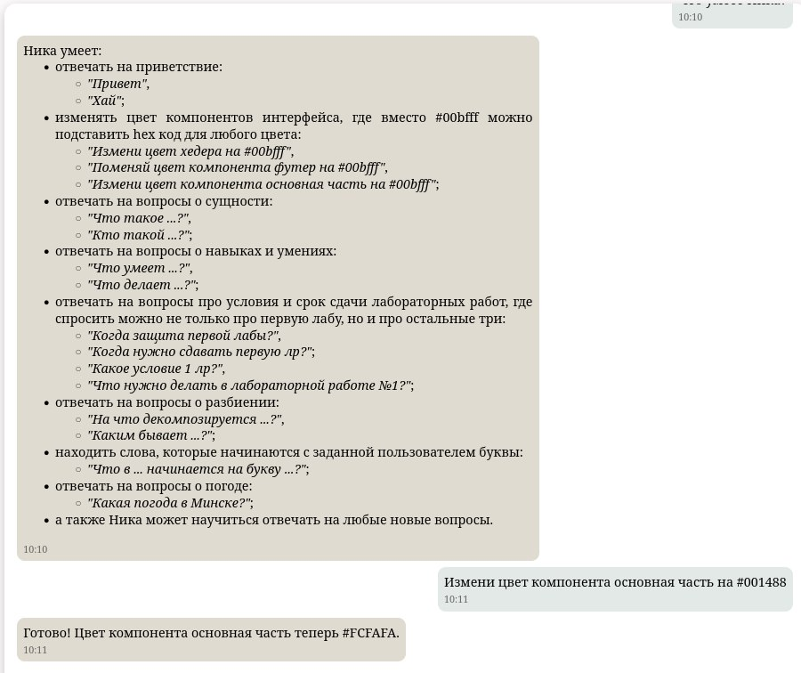

# Запуск проекта **NIKA** на новейшей версии **0.2.2**
## Введение
 В данном документе описана "починка" **NIKA**, а также описан метод добавления функций и изменения ответов данной OSTIS-системы. Следуя шагам мануала главного репозитория **[NIKA](https://github.com/ostis-apps/nika)** по установке проекта, вы обязательно столкнётесь с проблемой нехватки контейнера **ostis/nika:0.2.2** на **DockerHub**. Поэтому данный "гайд" поможет вам наконец-таки насладиться всей мощью **NIKA** версии **0.2.2**.


## Источник
Всю информацию можно найти самостоятельно в расширенном мануале по **NIKA**: **[click](https://ostis-apps.github.io/nika/index.ru/#nika)**.
Там же, во вкладке "Быстрый старт", будет находится набор команд по установке **NIKA**.

## Требования по установке
* **[ОС Linux](https://www.linux.org/pages/download/)**
**или** **[Виртуальная машина с **Linux**](https://www.virtualbox.org)**
* **[Git (система контроля версий)](https://git-scm.com/install/)**
* **[Node.js (платформа для работы с JavaScript)](https://nodejs.org/en/download)**

**Не рекомендуем использовать данный мануал для работы на WSL, из-за проблем с загрузкой sc-web** (возможно из-за отсутствия некоторых дистрибутивов).

## Установка
### Установка базового набора инструментов Python
```
sudo apt update
sudo apt install git build-essential python3 python3-venv python3-pip npm
```
### Quick start
Команды с вкладки "**[Быстрый старт](https://ostis-apps.github.io/nika/quick_start/)**":
#### 1. Clone repository of the NIKA:
```
git clone https://github.com/ostis-apps/nika
cd nika
git submodule update --init --recursive
```
#### 2. Install C++ problem solver:
```
./scripts/install_cxx_problem_solver.sh
```
#### 3. Build knowledge base:
```
./scripts/start.sh build_kb
```
#### 4. Run C++ problem solver:
```
./scripts/start.sh machine
```
#### 5. Install and build sc-web. Open new terminal and run
```
cd sc-web
./scripts/install_dependencies.sh
npm run build
cd ..
```
#### 6. Run sc-web:
```
./scripts/start.sh web
```
#### 7. Install Python problem solver dependencies. Open new terminal and run in the root of the project:
```
python3 -m venv problem-solver/py/.venv
source problem-solver/py/.venv/bin/activate
pip3 install -r problem-solver/py/requirements.txt
```
#### 8. Run Python problem-solver:
```
./scripts/start.sh py_server
```
#### 9. Install and build React interface. Open new terminal and run:

```
cd interface
npm install
npm run build
```

#### 10. Run React interface:
```
./scripts/start.sh interface
```

Теперь при запуске **NIKA** через `localhost:3033` в браузере она сможет выполнять такие команды, как:




