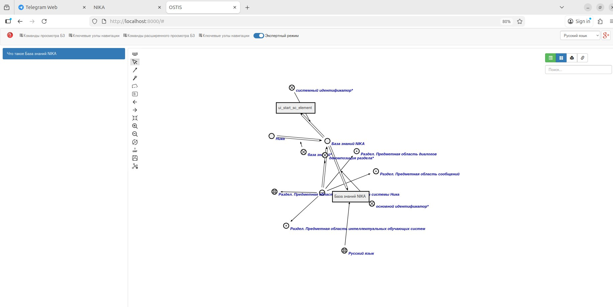
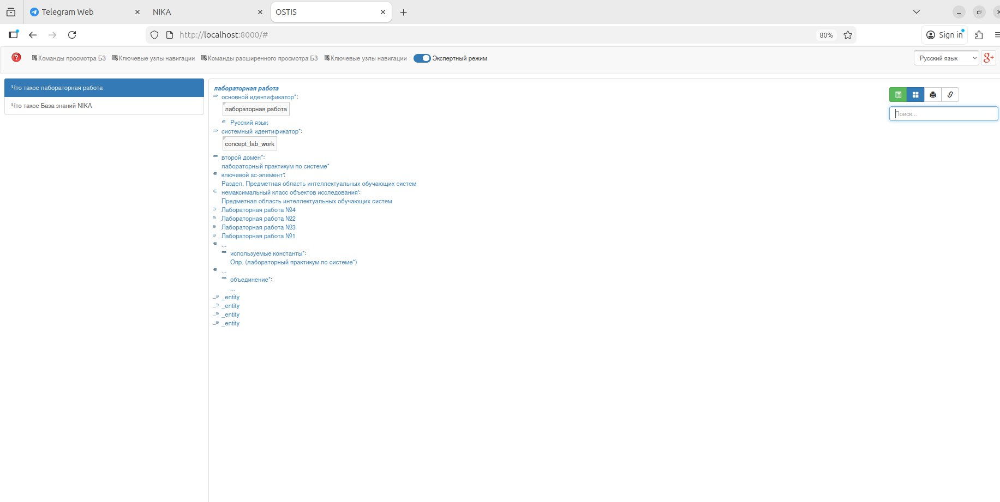
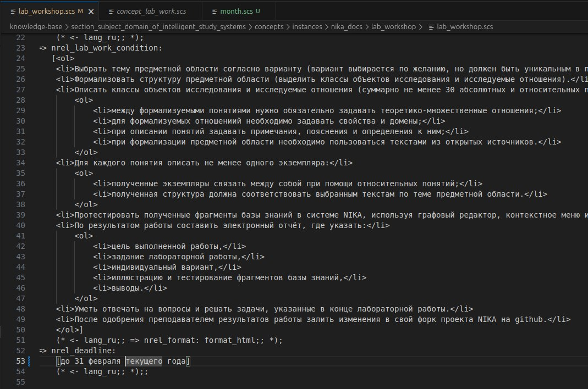
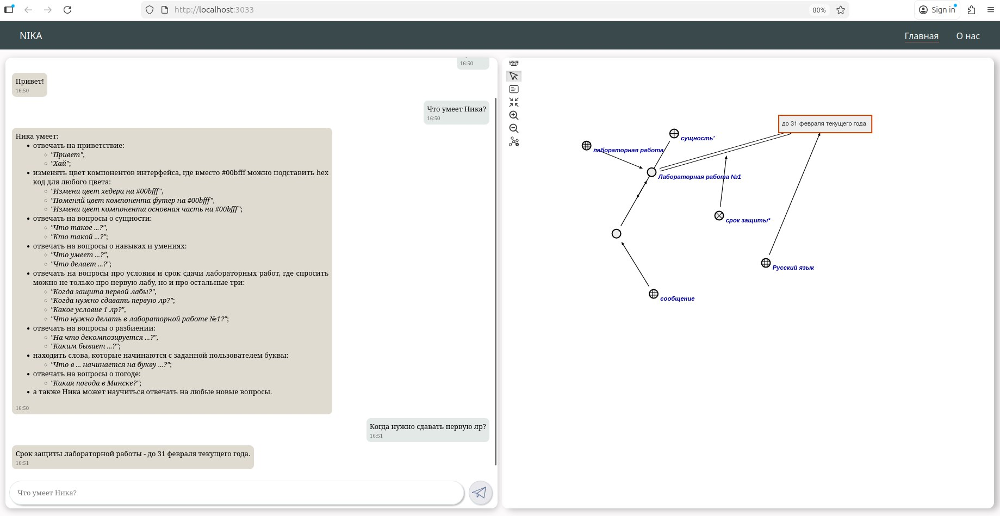

# Изменение функций проекта **NIKA 0.2.2**
## Введение
Данный документ содержит мануал по изменению функций проекта **NIKA**, в нашем случае — изменение ответа на запрос о сроке сдачи 1-ой лабораторной работы.

## База знаний
Для начала потребуется установить и запустить сам проект (мануал в репозитории), после чего перейти на сайт базы знаний используя запрос в адресной строке:
```
localhost:8000
```
Перейдя на сайт, включаем **SCg** - отображение страницы:
### 1) Включить экспертный режим (тумблер находится под адресной строкой);

### 2) Нажать на зелёную кнопку рядом с полем поиска;


В поле поиска вводим объект вопроса (в нашем случае лабораторная работа №1). Переходим в соответствующую вкладку и ищем необходимый узел, отвечающий за "срок защиты", с ним и будем работать.

## Терминал
Запускаем терминал и переходим в каталог с файлами **NIKA**. Вводим команду :
```
grep -R "ваш искомый объект (срок защиты)" knowledge-base/

```
Проходимся по файлам с раширением ***.scs**, где найдено вхождение. Найдя интересующий нас файл и меняем в нём дату сдачи:


Итог наших действий:


## Примечание!
Возможен также случай, что добавленных вами данных не хватает в базе знаний, как, например, в нашем случае не хватало месяцев.
Поэтому, чтобы решить данную проблему, советуем вам обратиться к мануалу **"Создание базы знаний для проекта **NIKA**"**.


